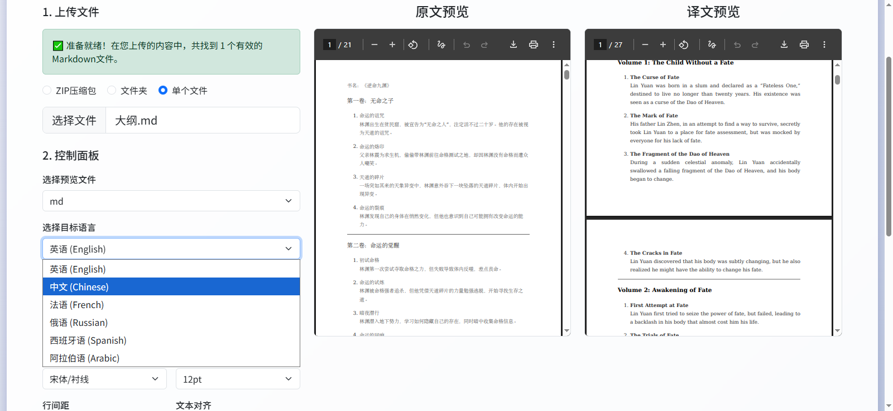
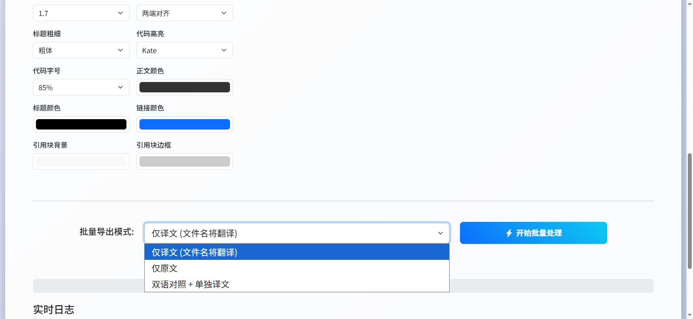

# Markdown to PDF Converter with AI Translation / 带AI翻译的Markdown转PDF转换器

[English](#english) | [中文](#中文)

---

## English

A Flask-based web service that converts Markdown files to PDF format with support for Chinese language and AI-powered translation to multiple languages.

### Features

- Convert Markdown files to PDF
- Support for Chinese display and typesetting
- AI-powered translation to multiple languages (English, Chinese, French, Russian, Spanish, Arabic, etc.)
- Customizable style options
- Batch conversion (upload ZIP files)
- Preview functionality for both original and translated documents
- Bilingual side-by-side comparison view
- Web-based user interface
- Multi-language support (Chinese/English)

### Quick Start

#### Using Docker (Recommended)

Build and start the service:

```bash
docker-compose up --build
```

Then access `http://localhost:8000`

#### Local Run

1. Install dependencies:

```bash
pip install flask pandas pypdf pypandoc weasyprint requests
```

2. Install system dependencies:
   - pandoc
   - texlive-xetex
   - texlive-lang-chinese

3. Run the application:

```bash
python ai_translator.py
```

### Usage Instructions

1. Open your browser and access the service address
2. Select the Markdown file or ZIP package containing Markdown files to convert
3. Choose target language for translation
4. Set conversion options (such as page size, margins, fonts, etc.)
5. Click the convert button to start conversion
6. Download the results after conversion is complete

### Configuration

To use the AI translation feature, you need to configure the following environment variables in [ai_translator.py](file:///d:/GUOSHIYIN/github%E4%BB%A3%E7%A0%81/markdown2pdf-trans/ai_translator.py):
- `AI_API_URL`: Your AI service API endpoint
- `AI_API_KEY`: Your API key
- `AI_MODEL`: The model to use for translation

### Screenshots





### Technical Architecture

This project uses a modern technology stack to provide reliable document conversion services with AI translation capabilities:

#### Backend Technologies
- **Python 3.12**: Main programming language
- **Flask**: Lightweight web framework for building RESTful APIs
- **pypandoc**: Python wrapper for Pandoc, used for Markdown to HTML conversion
- **WeasyPrint**: HTML to PDF converter with excellent CSS support
- **pypdf**: PDF processing library for additional PDF operations
- **pandas**: Data processing library for handling structured data in documents
- **requests**: HTTP library for AI translation API calls

#### Frontend Technologies
- **Bootstrap 5**: Modern CSS framework for responsive design
- **Vanilla JavaScript**: Client-side scripting for dynamic interactions
- **AJAX**: Asynchronous communication with backend APIs
- **HTML5/CSS3**: Modern markup and styling

#### System Dependencies
- **Pandoc**: Universal document converter (essential for Markdown processing)
- **TeX Live**: Typesetting system for high-quality document rendering
- **XeLaTeX**: LaTeX engine with Unicode and modern font support
- **Chinese Fonts**: Support for Chinese character rendering

#### Key Features
1. **AI Translation**: Powered by large language models for high-quality translation
2. **Asynchronous Processing**: Long-running conversion tasks are processed in the background
3. **Real-time Progress Tracking**: Users can monitor conversion progress and view logs
4. **Live Preview**: Preview functionality to see how documents will look before conversion
5. **Batch Processing**: Support for ZIP file uploads containing multiple documents
6. **Custom Styling**: Extensive customization options for fonts, colors, margins, etc.
7. **Multi-language UI**: Support for both Chinese and English interfaces
8. **Multiple Export Modes**: Original, translated, or bilingual side-by-side PDFs
9. **Error Handling**: Comprehensive error handling and user feedback

### API Endpoints

- `POST /upload`: Upload files for conversion
- `POST /convert`: Start the conversion process
- `GET /status/<task_id>`: Check conversion status
- `GET /preview/<task_id>`: Generate document preview
- `GET /download/<task_id>`: Download conversion results

### License

[Apache License 2.0](LICENSE)

---

## 中文

一个基于 Flask 的 Web 服务，可以将 Markdown 文件转换为 PDF 格式，支持中文排版和AI驱动的多语言翻译。

### 功能特点

- 将 Markdown 文件转换为 PDF
- 支持中文显示和排版
- AI驱动的多语言翻译（英语、中文、法语、俄语、西班牙语、阿拉伯语等）
- 支持自定义样式选项
- 支持批量转换（上传 ZIP 文件）
- 支持原文和译文预览功能
- 双语并排对比视图
- 基于 Web 的用户界面
- 支持中英文双语界面

### 快速开始

#### 使用 Docker（推荐）

构建并启动服务：

```bash
docker-compose up --build
```

然后访问 `http://localhost:8000`

#### 本地运行

1. 安装依赖：

```bash
pip install flask pandas pypdf pypandoc weasyprint requests
```

2. 安装系统依赖：
   - pandoc
   - texlive-xetex
   - texlive-lang-chinese

3. 运行应用：

```bash
python ai_translator.py
```

### 使用说明

1. 打开浏览器访问服务地址
2. 选择要转换的 Markdown 文件或包含 Markdown 文件的 ZIP 包
3. 选择翻译的目标语言
4. 设置转换选项（如页面大小、边距、字体等）
5. 点击转换按钮开始转换
6. 转换完成后下载结果

### 配置

要使用AI翻译功能，您需要在 [ai_translator.py](file:///d:/GUOSHIYIN/github%E4%BB%A3%E7%A0%81/markdown2pdf-trans/ai_translator.py) 中配置以下环境变量：
- `AI_API_URL`：您的AI服务API端点
- `AI_API_KEY`：您的API密钥
- `AI_MODEL`：用于翻译的模型

### 截图


### 技术架构

该项目使用现代化的技术栈，提供可靠的文档转换服务，并集成了AI翻译功能：

#### 后端技术
- **Python 3.12**：主要编程语言
- **Flask**：用于构建 RESTful API 的轻量级 Web 框架
- **pypandoc**：Pandoc 的 Python 封装，用于 Markdown 到 HTML 的转换
- **WeasyPrint**：具有出色 CSS 支持的 HTML 到 PDF 转换器
- **pypdf**：用于额外 PDF 操作的 PDF 处理库
- **pandas**：用于处理文档中结构化数据的数据处理库
- **requests**：用于AI翻译API调用的HTTP库

#### 前端技术
- **Bootstrap 5**：用于响应式设计的现代 CSS 框架
- **原生 JavaScript**：用于动态交互的客户端脚本
- **AJAX**：与后端 API 的异步通信
- **HTML5/CSS3**：现代标记和样式

#### 系统依赖
- **Pandoc**：通用文档转换器（Markdown 处理必需）
- **TeX Live**：高质量文档渲染的排版系统
- **XeLaTeX**：支持 Unicode 和现代字体的 LaTeX 引擎
- **中文字体**：支持中文字符渲染

#### 核心特性
1. **AI翻译**：由大语言模型驱动，提供高质量翻译
2. **异步处理**：后台处理长时间运行的转换任务
3. **实时进度跟踪**：用户可以监控转换进度并查看日志
4. **实时预览**：预览功能可在转换前查看文档外观
5. **批量处理**：支持包含多个文档的 ZIP 文件上传
6. **自定义样式**：提供丰富的字体、颜色、边距等自定义选项
7. **多语言界面**：支持中英文界面
8. **多种导出模式**：原文、译文或双语并排PDF
9. **错误处理**：全面的错误处理和用户反馈

### API 接口

- `POST /upload`：上传文件进行转换
- `POST /convert`：开始转换过程
- `GET /status/<task_id>`：检查转换状态
- `GET /preview/<task_id>`：生成文档预览
- `GET /download/<task_id>`：下载转换结果

### 许可证

[Apache License 2.0](LICENSE)